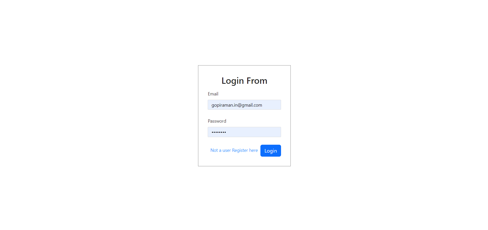

# Campus Care – College Dispensary Appointment System

> Your campus health, one click away.  
> A full-stack **MERN** app that lets students book appointments, doctors manage schedules, and admins oversee users and approvals.

---

## 🌐 User Roles & Features

**Student**
- Register/Login securely
- Book and manage appointments
- View appointment history & status notifications

**Doctor**
- Apply for registration
- View/approve/reject appointment requests
- Manage availability

**Admin**
- Approve/Reject doctor applications
- Manage students & doctors
- Monitor overall platform activity

---

## 🛠️ Tech Stack

- **Frontend:** React.js, Redux Toolkit, Ant Design, Axios, React Router  
- **Backend:** Node.js, Express.js  
- **Database:** MongoDB Atlas  
- **Auth:** JSON Web Tokens (JWT)  
- **Env:** dotenv

---

## 📂 Project Structure

```bash
Campus_care/
├── backend/
│   ├── config/        # DB connection, JWT helpers
│   ├── controllers/   # Route logic
│   ├── models/        # Mongoose schemas
│   ├── routes/        # Express routes
│   ├── server.js      # Backend entry
│   └── .env           # Local environment variables (not committed)
└── frontend/
    ├── src/
    │   ├── components/
    │   ├── pages/
    │   ├── redux/
    │   └── App.js
    ├── public/
    └── package.json
```
---

## 📸 Screenshots

### 📸 Screenshots

### 🔑 Login Page
Users can log in securely using their credentials.  


### 🏠 Student Home Page
Dashboard view for students after login.  


### 📅 Student Can Book Their Appointment
Students can book new appointments with doctors.  


### 📋 Student Appointment List
Students can view their upcoming and past appointments.  


### 🏥 Doctor's Approval for Appointment
Doctors can approve or reject appointment requests.  


### 👨‍💼 Admin Home Page
Admin dashboard for managing campus care services.  


### ⚙️ Admin Control on Users
Admin can manage and control registered users.  

